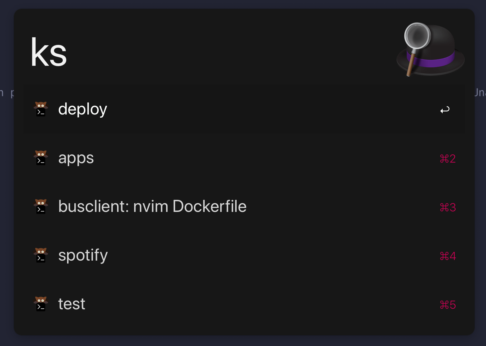

# alfred-kitty-tab-switch

Quickly switch between tabs in [Kitty terminal](https://sw.kovidgoyal.net/kitty/) using Alfred.

Invoke Alfred, type "ks" you should be shown a list of kitty tabs.

## Requirements
- awk
- sed
- jq (in /usr/local, but you can edit the workflow to your needs)
- kitty must be spawned with a remote control socket located at `/tmp/mykitty` (see https://25.wf/blog/alfred-kitty/index.html for instructions on how to set this up)

## Limitations
I've only tested this with one kitty window and one kitty instance.
